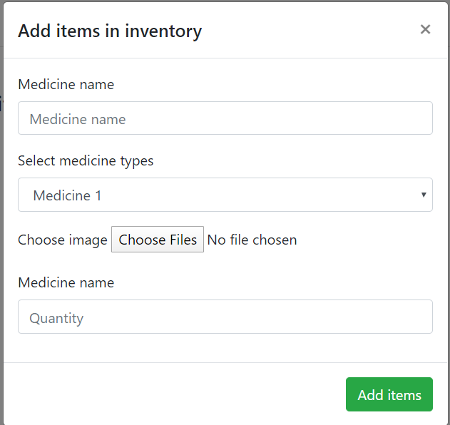

# Inventory management system 

This system is used for keeping the record of the medicine (Medicine name,type,image,quantity).
We have used four differnt js file here:

* app.js
* UIcontroller.js
* DataController.js
* LocalStorage.js

Flow of the program

> when you run index.html then initially you will observe the following event happening in your screen

The list Item will later on display the name list of the medicines.

>Then you click the add button you will see a pop up card that is the card where you can add and update the details of the medicine.

looks something like this:

> When you input the the information the information gets updated in the localstorage

> The name of the medicine will also get displayed in the main display screen

> When you click any item in the list you obtain the full details of the medicine

> Now when you want to update the file then you click update.

> After updating the file you will se the updated result 

> The deleted button removes the content .

